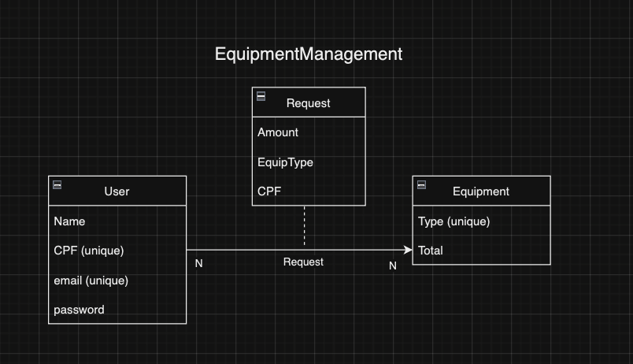
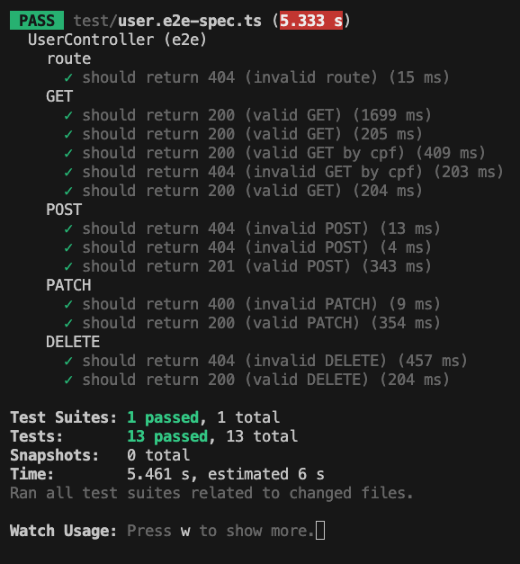

### Equipment Management BackEnd Service

Esse projeto implementa um serviço backend RESTful para a seguinte modelagem:



## Como executar

Por favor, clonar o respositório da "develop" branch, onde eu temporariamente expus o arquivo .env para acesso ao serviço de banco de dados Neon. 

<br>
<br>
<br>

Com Node.js instalado, execute "npm run start:dev" ou "npm run start" no diretório raíz. Faça as requisições através de "localhost:3000/"

<br>
<br>
<br>

Se quiser zerar o sistema (apagar entradas atuais), execute "npx prisma db seed" no diretório raíz. 

## Requisições

O sistema trata requisições CRUD para 3 endpoints:
- /user (usuário)
- /equipment (equipamento)
- /request (solicitação de equipamento)

Um usuário possui nome, CPF, email e senha. CPF e email são únicos. Você pode buscar (GET), atualizar (PATCH) ou deletar (DELETE) usuários pelo seu CPF. <br><br>

O arquivo "user.dto.ts" contém a documentação completa para criar (POST) e atualizar (PATCH) usuários, através do corpo (body) da requisição. 
<br><br>

Exemplo de body para /user (POST): 
```
{
    "name": "Waldemir do Santos",
    "cpf": "11122233344",
    "email": "wald@gmail.com",
    "password": "kQJ72-9R8<!iz^"
}
```
<br><br><br>

Um equipamento possui tipo e total. Tipo é único. Você pode buscar (GET), atualizar (PATCH) ou deletar (DELETE) usuários pelo seu tipo. <br><br>

O arquivo "equipment.dto.ts" contém a documentação completa para criar (POST) equipamentos, através do corpo (body) da requisição. <br><br>

Exemplo de body para /equipment (POST): 
```
{
  "type": "trator",
  "total": 10
}
```
<br><br><br>

Uma solicitação possui quantidade, CPF de usuário e tipo de equipamento. Você pode buscar (GET), atualizar (PATCH) ou deletar (DELETE) solicitação pelo seu id. <br><br>

O arquivo "request.dto.ts" contém a documentação completa para criar (POST) solicitações, através do corpo (body) da requisição. <br><br>

Ao criar uma solicitação, o saldo do tipo de equipamento em estoque é verificado e, se positivo, atualizado. <br><br>

Também é possível reverter uma solicitação, apagando-a. O saldo do tipo de equipamento em estoque é novamento atualizado. 
<br><br>

Exemplo de body para /request (POST): 
```
{
    "userCPF": "11122233344",
    "equipType": "trator",
    "amount": 3
}
```
<br><br><br>

## Tecnologia e Arquitetura

O código foi escrito em Nest.js, utilizando a arquitetura de Module/Controller/Service. O package Prisma foi adicionado para facilitar a estruturação e queries ao banco de dados (servido pela Neon). Além de User, Equipment e Request, há também o módulo Repository que trata a conexão com o banco. 

## Testes

O projeto foi desenvolvido iterativamente, e possui uma cobertura de testes ponta-a-ponta (e2e). 

